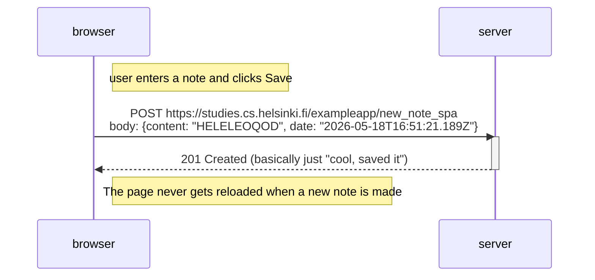

```mermaid
sequenceDiagram
    participant browser
    participant server

    Note right of browser: user enters a note and clicks Save

    browser->>server: POST https://studies.cs.helsinki.fi/exampleapp/new_note_spa<br/>body: {content: "HELELEOQOD", date: "2026-05-18T16:51:21.189Z"}
    activate server
    server-->>browser: 201 Created (basically just "cool, saved it")
    deactivate server

    Note right of browser: The page never gets reloaded when a new note is made
```
